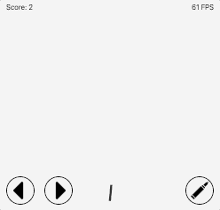

# svelte.demo.war

Это демо проект игры на фреймворке Svelte   
http://sveltewar.phpqa.ru/

  
https://habr.com/ru/post/452684/
### Клонируем шаблон для разработки

```
git clone https://github.com/dionisvl/svelte.demo.war.git
```

### Устанавливаем зависимости.

```
cd template/
npm i
```


### Запускаем dev сервер.

```
npm run dev
```

Наш шаблон доступен по адресу
http://localhost:5000. Сервер поддерживает hot reload, поэтому наши изменения будут видны в браузере по мере сохранения изменений.

Если вы не хотите разворачивать среду локально, то можете использовать онлайн песочницы codesandbox и stackblitz, которые поддерживают Svelte.


## Deploying to the web

### With [now](https://zeit.co/now)

Install `now` if you haven't already:

```bash
npm install -g now
```

Then, from within your project folder:

```bash
cd public
now deploy --name my-project
```

As an alternative, use the [Now desktop client](https://zeit.co/download) and simply drag the unzipped project folder to the taskbar icon.

### With [surge](https://surge.sh/)

Install `surge` if you haven't already:

```bash
npm install -g surge
```

Then, from within your project folder:

```bash
npm run build
surge public my-project.surge.sh
```


## PWA
- Загружаем сайт в Google Play https://vc.ru/dev/76260-zagruzhaem-sayt-v-google-play
- Upload PWA to Playstore https://appmaker.xyz/pwa-to-apk/
- Web App Manifest Generator https://app-manifest.firebaseapp.com/
- Service Workers https://developers.google.com/web/fundamentals/primers/service-workers

### TODO
- Добавить обработку проигрыша, когда один из врагов добрался до нижней границы экрана;
- Добавить подсчет очков;
- Добавить экран старта и окончания игры с выводом текущих и максимально набранных очков;
- Добавить управление с клавиатуры;
- Добавить логику увеличения интенсивности появления и скорости движения врагов с каждым убитым. Постепенное увеличение сложности добавит реиграбельности.
